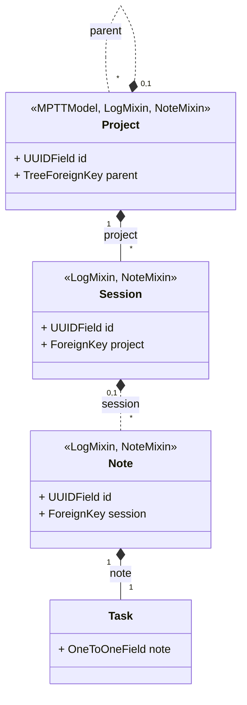

# labbook

## data model

```mermaid
classDiagram
    direction BT

    class Project {
        <<MPTTModel, LogMixin, NoteMixin>>

        + UUIDField id
        + TreeForeignKey parent
    }
    Project "*" ..* "0,1" Project : parent

    class Session {
        <<LogMixin, NoteMixin>>

        + UUIDField id
        + ForeignKey project
    }
    Session "*" --* "1" Project : project

    class Note {
        <<LogMixin, NoteMixin>>

        + UUIDField id
        + ForeignKey session
    }
    Note "*" ..* "0,1" Session : session

    class Task {
        + OneToOneField note
    }
    Task "1" --* "1" Note : note
```
